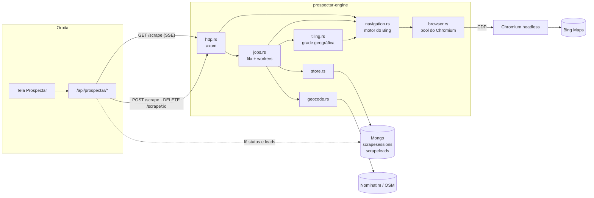
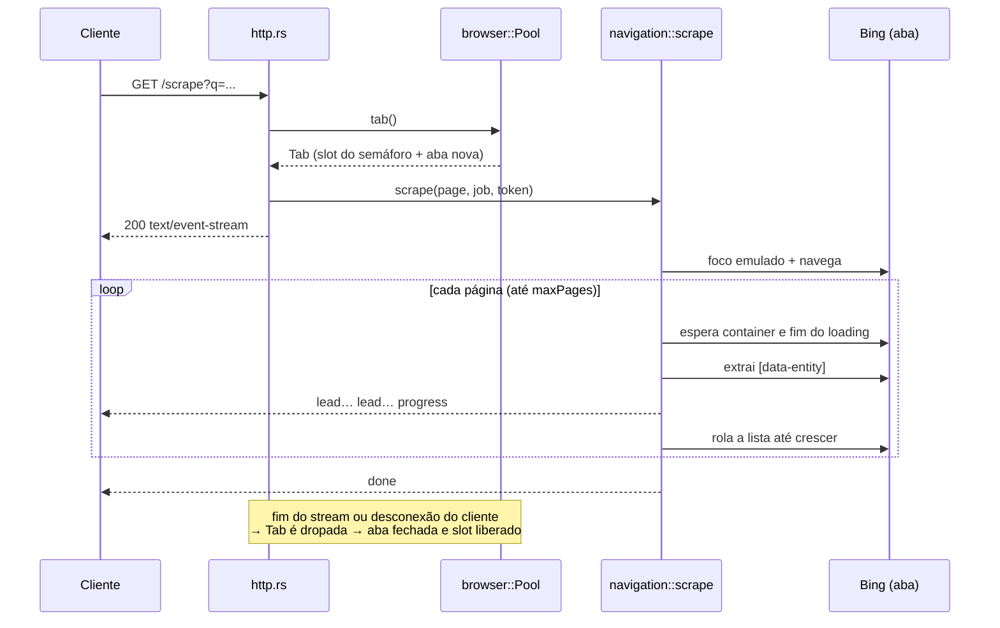
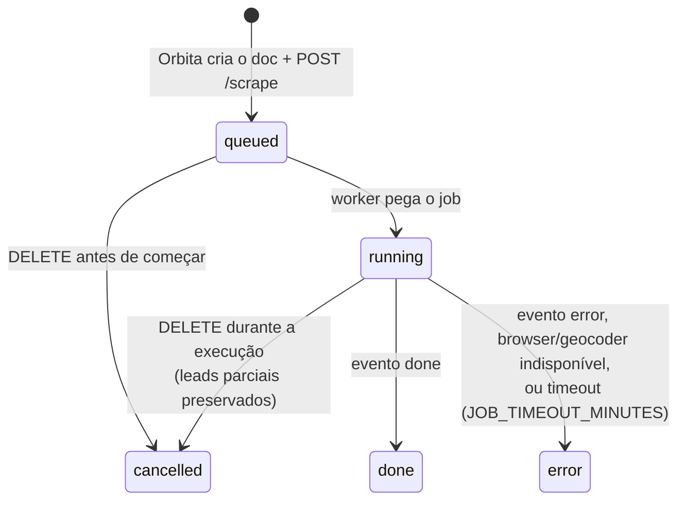

# Arquitetura

## Visão geral



O serviço tem dois modos que reusam o mesmo motor de navegação:

- **SSE (`GET /scrape`)** — síncrono e stateless. Cada evento sai no stream
  assim que é produzido. Usado em testes e como fallback.
- **Fila (`POST /scrape`)** — assíncrono e lastreado no Mongo. É o caminho que
  o Orbita usa em produção: o Orbita cria o documento em `scrapesessions`, o
  motor responde `202` e um worker raspa em background, gravando leads e
  progresso. O Orbita faz polling do Mongo; o motor não expõe leitura.

## Módulos

| arquivo | responsabilidade | equivalente no Go |
|---|---|---|
| `main.rs` | bootstrap: env, Mongo, fila, servidor, shutdown gracioso | `main.go` |
| `http.rs` | rotas, validação, SSE, CORS | `main.go` |
| `domain.rs` | `Lead`, `Job`, `Event` — o contrato de dados | `internal/domain` |
| `navigation.rs` | dirige a aba no Bing, pagina por scroll, emite eventos | `internal/navigation` |
| `parsing.rs` | `data-entity` (JSON) → `Lead`; seletores das 2 variantes de layout | `internal/parsing` |
| `browser.rs` | Chromium compartilhado, abas, semáforo de concorrência | `internal/browser` |
| `jobs.rs` | fila em memória, workers, cancelamento, timeout | `internal/jobs` |
| `store.rs` | escrita no Mongo (status, progresso, leads) | `internal/store` |
| `tiling.rs` | grade geográfica, ordem centro→fora, parada na meta | `internal/tiling` |
| `geocode.rs` | Nominatim com cache e rate limit | `internal/geocode` |
| `place.rs` | normalização de nome/telefone/endereço e chave de dedupe | `internal/place` |
| `gofmt.rs` | formatação idêntica ao Go (`%g`, `url.QueryEscape`, `url.Values.Encode`) | — |

## Fluxo do modo SSE



## Fluxo do modo fila e ciclo de vida do job



O worker consome os eventos do motor e traduz para o Mongo:

| evento | efeito em `scrapesessions` / `scrapeleads` |
|---|---|
| `lead` | acumula no lote em memória |
| `progress` | grava o lote em `scrapeleads` (`insertMany`) e atualiza `leadCount`; na varredura por área grava `tilesDone`/`tilesTotal` |
| `done` | grava o lote restante, `status: "done"`, `leadCount` final |
| `error` | grava o lote restante, `status: "error"`, `error: <mensagem>` |

Se o stream fecha sem `done`/`error`, o job foi interrompido: vira `cancelled`
se houve `DELETE`, senão `error` com "scrape interrompido (timeout ou
cancelamento)".

## Cancelamento

Todo o cancelamento é feito com `CancellationToken` em hierarquia, o que
substitui o `context.Context` do Go:

```
token do job (cancelado por DELETE ou timeout)
 └── token da aba (cancelado também quando a Tab é dropada)
      └── token da célula (varredura por área; cancelado ao atingir a meta)
```

Toda espera do motor (`sleep`, avaliação de JS, envio de evento) disputa com o
token num `tokio::select!`, então o cancelamento é imediato. Fechar a aba é
responsabilidade do `Drop` da `Tab`: qualquer caminho que solte a `Tab` — fim
normal, erro, cliente desconectado, job cancelado — fecha a aba e devolve o
slot do semáforo.

## Varredura por área (tiling)

Com `location`, o job:

1. Geocodifica o local no Nominatim (bounding box). As consultas respeitam o
   limite de 1 req/s da política do Nominatim e ficam em cache por processo.
2. Divide a caixa numa grade com células de `cellKm` (default 3 km, mínimo
   0,25 km). Se a grade passar de 2000 células, o passo dobra até caber.
3. Ordena as células do **centro para fora** — os bairros centrais, onde há mais
   negócios, são raspados primeiro.
4. Raspa cada célula (`maxPages` páginas, zoom derivado do tamanho da célula,
   entre 10 e 17) e **para ao atingir `targetLeads`**, cancelando a célula em
   curso.
5. Deduplica entre células por uma chave de lugar (abaixo). Uma célula com
   erro não derruba o job; o erro só aparece se nenhum lead foi coletado.

### Chave de deduplicação (`place.rs`)

Em ordem de prioridade:

1. `tel:+55DDDNUMERO` — telefone brasileiro válido normalizado. Pega o mesmo
   negócio com nomes diferentes ("Restaurante X" × "Restaurante X - Centro").
2. `src:<id do Bing>` — quando o nome normalizado fica vazio.
3. `geo:<nome>@<célula de ~55 m>` — nome normalizado (sem acento, pontuação e
   sufixos societários como LTDA/ME/EIRELI) + coordenada arredondada.
4. `name-addr:` / `name:` — sem coordenadas.

## Contrato de dados

Mudou aqui, muda no Orbita (`src/lib/types.ts`, `src/models/ScrapeSession.ts`,
`src/models/ScrapeLead.ts`).

**Lead** (JSON no SSE e subdocumento `lead` no Mongo; ordem e nomes de campo
idênticos ao Go):

```json
{
  "id": "ypid:YN54F24900D493DD1B",
  "name": "Beatriz Batista - Nutricionista",
  "address": "Avenida Paulista, 668, São Paulo, São Paulo",
  "phone": "(11) 93469-0909",
  "website": "http://www.beatrizbatista.com.br/",
  "category": "Nutricionista",
  "rating": "4.7",
  "ratingCount": "128",
  "latitude": -23.56687355041504,
  "longitude": -46.64968490600586,
  "openHours": "",
  "imageUrl": "https://www.bing.com/th?id=...",
  "mapsUrl": "https://www.bing.com/maps?q=...&cp=-23.56687355041504~-46.64968490600586"
}
```

`latitude`/`longitude` são `null` quando o Bing não informa.

**`scrapeleads`** — um documento por lead:
`{ jobId: ObjectId, seq: int, createdAt: Date, lead: <Lead> }`, com índice
`{ jobId: 1, seq: 1 }`. `seq` é contíguo a partir de 0 por job; o Orbita
ordena por ele. Inteiros vão como `int32` quando cabem, como o driver Go faz.

**`scrapesessions`** — o motor só atualiza: `status`, `leadCount`, `tilesDone`,
`tilesTotal`, `error` e `updatedAt` (via `$currentDate`). Quem cria o documento
é o Orbita.

## Notas de operação

Herdadas do motor Go e confirmadas no port:

- **Serializado por padrão (`SCRAPE_CONCURRENCY=1`).** O Bing serve uma página
  degradada (~5 resultados, scroll não carrega mais) quando recebe buscas
  concorrentes do mesmo IP. É anti-abuso do Bing, não limite do browser. Só
  suba a concorrência com rotação de IP/proxy.
- **Foco emulado (`Emulation.setFocusEmulationEnabled`).** A aba nasce em
  background e o Bing pausa o infinite-scroll em abas ocultas. Emular foco
  destrava a paginação sem trazer a aba para frente.
- **Paginação = scroll repetido.** Um único `scrollTop = scrollHeight` não
  dispara o lazy-load; o motor continua rolando enquanto a lista cresce, por
  até 8 s por página.
- **Vai quebrar quando o Bing mudar o DOM.** Os seletores vivem em
  `parsing.rs` (`VERSIONS`). `SCRAPER_DEBUG=1` mostra onde a paginação parou;
  `RUST_LOG=debug` mostra falhas de avaliação de JS.
- **`WS Invalid message` no log é esperado.** O Chrome atual emite eventos de
  protocolo mais novos que as definições do `chromiumoxide` 0.9; a biblioteca
  os ignora. O motor não depende de nenhum deles (ver armadilha 4).

## Armadilhas do port Go → Rust

O port foi validado contra o motor Go lado a lado (seção seguinte). No
caminho, seis diferenças entre `chromedp` e `chromiumoxide`/`serde` quebravam
o resultado em silêncio. Todas têm teste de regressão.

1. **WebGL desligado → 0 leads.** O `DisableGPU` do chromedp passa duas flags:
   `--disable-gpu` **e** `--enable-unsafe-swiftshader`. Com só a primeira, o
   Chrome atual desliga o WebGL e o Bing Maps redireciona para
   `/maps/sharing?...&webglerror=a`, sem resultados.
2. **Flags repetidas são mescladas, não sobrescritas.** O `chromiumoxide` tem
   `--lang=en_US` nos defaults e junta valores de chaves iguais: o `lang=pt-BR`
   virava `--lang=en_US,pt-BR`, um locale inválido — em Linux o Bing devolveria
   categorias em inglês. O motor desliga os defaults
   (`disable_default_args`) e passa exatamente a lista de flags do chromedp.
3. **Perfil compartilhado entre processos.** O default do `chromiumoxide` é um
   `user-data-dir` fixo (`$TMPDIR/chromiumoxide-runner`); um segundo Chromium
   (relançamento, outro processo) morre com `SingletonLock: File exists`. Cada
   launch agora usa um diretório próprio, apagado no shutdown — como o
   chromedp.
4. **Contexto de execução obsoleto.** O `evaluate_expression` do
   `chromiumoxide` anexa o ID de contexto que ele rastreia; como ele perde
   eventos de protocolo do Chrome atual, o ID às vezes está velho e a
   avaliação falha com `Cannot find context with specified id`. Uma falha
   dessas na checagem do loading fazia o motor rolar antes de o Bing estar
   pronto, e a paginação morria na página 1. O motor envia `Runtime.evaluate`
   cru, sem `contextId`, como o chromedp — o Chrome usa sempre o contexto atual.
5. **Parsing de float impreciso.** O `serde_json` padrão não arredonda
   corretamente alguns floats (erra 1 ULP): `-23.567733764648438` virava
   `-23.56773376464844`. Resolvido com a feature `float_roundtrip`.
6. **Desempate no `%g`.** Para coordenadas cujo valor exato termina em `…5` no
   17º dígito, o Go desempata para o par (`…062`) e o `format!("{:e}")` do Rust
   para cima (`…063`), mudando o `mapsUrl`. `gofmt::format_g` deriva os dígitos
   do serializador do `serde_json`, que desempata como o Go.

## Validação de paridade com o motor Go

Método: os dois motores rodando localmente com o mesmo Chrome, a mesma busca
disparada em sequência (nunca em paralelo, por causa do anti-abuso do Bing), e
os leads comparados por `id` e campo a campo.

| busca | Go | Rust | IDs em comum | campos divergentes |
|---|---|---|---|---|
| dentista em Campinas (4 págs.) | 34 | 34 | 34 | 0 |
| dentista em Campinas (repetição) | 34 | 34 | 34 | 0 |
| advogado em Recife (4 págs.) | 17 | 17 | 17 | 0 |
| psicologo em Curitiba (3 págs.) | 43 | 43 | 43 | 0 |

A fila assíncrona foi validada contra um Mongo local, no host e dentro do
container Docker: job de ponto único (36 leads, `seq` contíguo, tipos BSON
iguais ao Go), varredura por área (195 células geradas, parada na 19ª ao
atingir a meta de 40 leads, zero duplicatas), cancelamento de job rodando
(leads parciais preservados) e de job na fila (nunca executa), e `docker stop`
(sai com código 0, sem processos órfãos).
